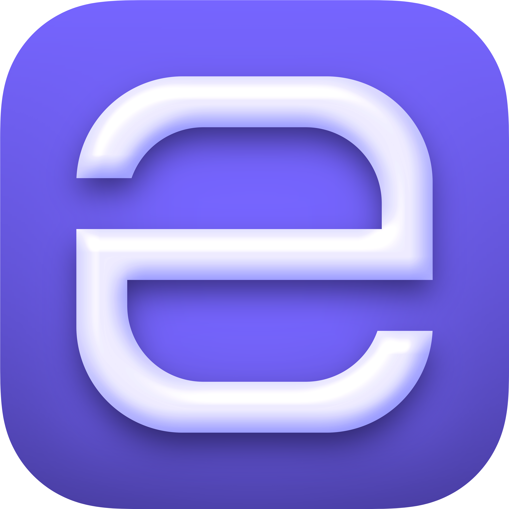

  
  <h1>The Une Programming Language</h1>

 

Une (as in *une*-iverse) is a simple interpreted programming language inspired by C, JavaScript, and Python.

It was originally created as part of my 2021 Matura paper on creating a programming language, but has since turned into a personal playground for experimenting with software design and development tools.

Pre-built binaries can be found under [releases](https://github.com/thechnet/une/releases).

## Building

- Install [Clang](https://clang.llvm.org), [CMake](https://cmake.org), and a build system of your choice (for example *make*).
- Create a build directory somewhere on your system and enter it.
- Run `cmake <root> -G <gen>`, where
  - `<root>` points to the root of this repository, and
  - `<gen>` is the generator for your build system.

  (To build the debug version, append `-DCMAKE_BUILD_TYPE=Debug` to the above command.)
- Compile the binary using your build system.

To run the test suite:

- Install [Python 3](https://www.python.org).
- Build the debug version.
- Run `test.py` from within your build directory.

## Getting Started

Run Une without any arguments to display its usage.

From there, check out some of the [examples](https://github.com/thechnet/une/tree/main/examples) or refer to the [documentation](DOCUMENTATION.md).

## Language Support

[The Une extension](https://marketplace.visualstudio.com/items?itemName=chnet.une) provides basic language support for Visual Studio Code.
