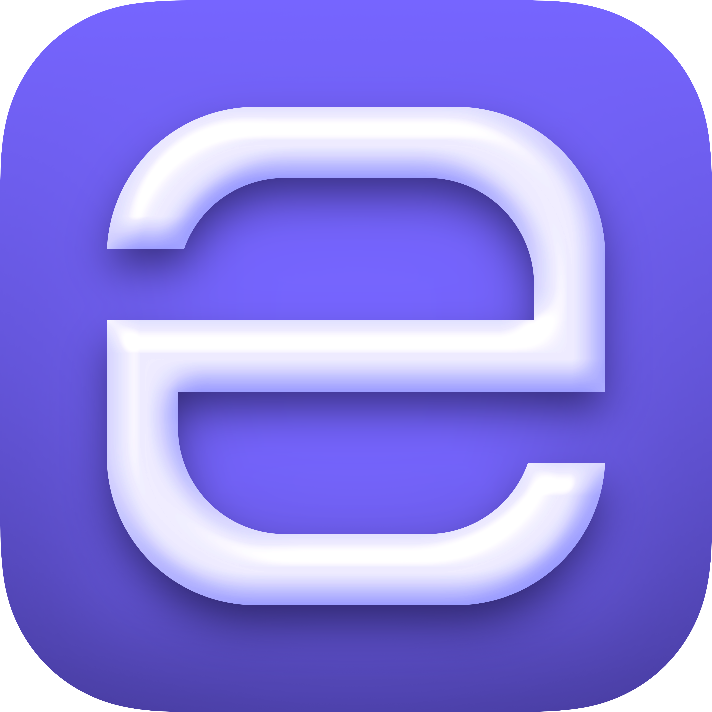

# Une

[](https://open.vscode.dev/thechnet/une)

## What is Une?

Une */ˈjun/* is an **unfinished, unpolished, and *very* simple** interpreted programming language written in C as part of my 2021 Matura paper.

## What can Une do?

Une supports most basic language capabilities one expects from an interpreted programming language, but it doesn't go much further than that.
Some demo programs can be found in [examples](examples).

## How do I run Une?

### 1. Getting the executable

To get Une, you can download the latest binary from [the releases page](https://github.com/thechnet/une/releases/latest).

Alternatively, you can build it yourself:

- Install [LLVM Clang](https://clang.llvm.org), [CMake](https://cmake.org), and the build system of your choice (*make* is recommended).
- For the release version:
  - Create a "release" directory in the repository.
  - Inside the "release" directory, run `cmake .. -G <gen>` (where `<gen>` is your build system of choice).
- For the debug version:
  - Create a "debug" directory in the repository.
  - Inside the "debug" directory, run the same command as above but append `-DCMAKE_BUILD_TYPE=Debug`.
- In the same directory, compile the binary using your build system.

### 2. Running a script

Running Une without any arguments will give you its usage:

```
> une
…
Usage: une {<script>|-s <string>|-i}
```

Run the `arithmetic_interpreter.une` example. It should print `7`:

```
> une examples/arithmetic_interpreter.une
7
```

Directly pass commands to Une using the `-s` flag:

```
> une -s "print(\"Hello, Une\")"
Hello, Une
```

Enter the interactive mode using the `-i` flag:

```
> une -i
```

For more information, refer to the documentation or check out some of the examples.

### 3. Running the test suite

To run the test suite, build the debug version of Une (see 1.), `cd` into `testing`, and run `test.py` using Python 3.

The Python script will ask for manual input twice for the first test case. The remaining cases will not require manual input.

## Visual Studio Code Language Support

If you're using Visual Studio Code, make sure to install [the Une extension](https://marketplace.visualstudio.com/items?itemName=chnet.une) to get syntax highlighting and general language support. Its repository can be found [here](https://github.com/thechnet/une-vscode).

<br/>


